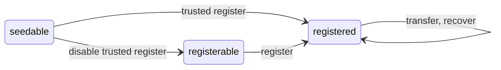

# Farcaster Contracts Documentation

Documentation that covers the high-level functionality of each contract in the system.

## Table of Contents

1. [ID Registry](#1-id-registry)
2. [Storage Contract](#2-storage-contract)

## 1. ID Registry

The ID Registry contract issues Farcaster IDs (fids) for the Farcaster network.

An `fid` is a uint256 that represents a unique user of the network. Fids begin at 0 and increment by one for every new account. There is an infinite supply of fids since they can go as high as ~10^77. IDs begin in the seedable state, where they can only be registered by a pre-determined address. The owner can disable trusted registration which then allows anyone to register an fid.

Each address can only own a single fid at a time, but they can otherwise be freely transferred between addresses. The address that currently owns an fid is known as the `custody address`. The `custody address` can nominate a `recovery address` that is authorized to move a fid on its behalf. This can be changed or removed at any time.

### State Machine

An fid can exist in these states:

- `seedable` - the fid has never been issued, and can be registered by the trusted caller
- `registerable` - the fid has never been issued, and can be registered by anyone
- `registered` - the fid has been issued to an address

The fid state transitions when users take specific actions:

- `register` - register a new fid from any address
- `trusted register` - register a new fid from the trusted caller
- `disable trusted register` - allow registration from any sender
- `transfer` - move an fid to a new custody address
- `recover` - recover (move) an fid to a new custody address

# 2. Storage Contract

TBD
