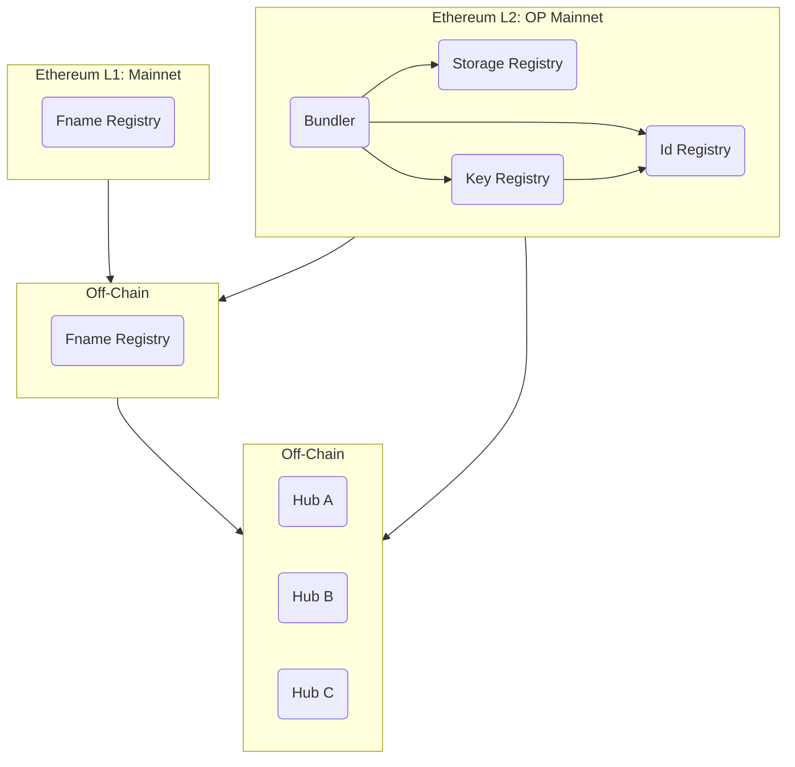
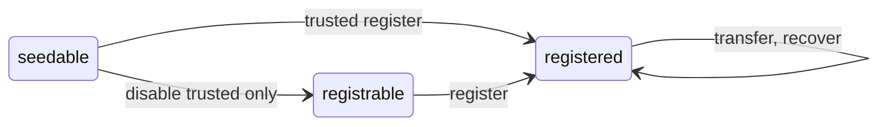
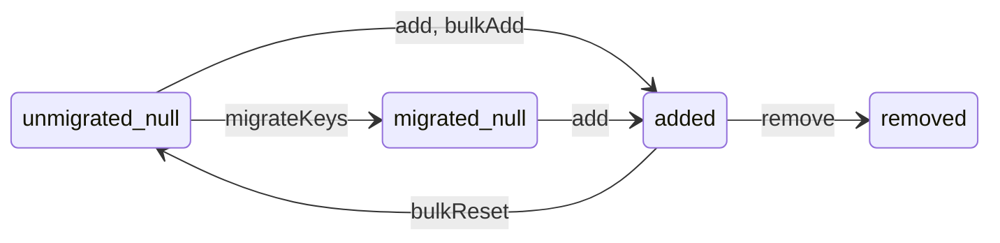

# Farcaster Contracts

Users create accounts by registering with on-chain contracts. Farcaster contracts help set up identity key pairs, signing key pairs, usernames and with acquiring storage on off-chain systems. Contracts are deployed across multiple chains and off-chain services track the state of the these contracts by watching for events.

This documentation is focussed on the contracts but also clarifies assumptions made by off-chain services. For a full overview of the Farcaster protocol, please [read the docs](https://docs.farcaster.xyz/) or watch the [overview videos](https://www.youtube.com/playlist?list=PL0eq1PLf6eUdm35v_840EGLXkVJDhxhcF).

## Table of Contents

1. [L2 Contracts](#1-l2-contracts)
   1. [Id Registry](#11-id-registry)
   2. [Storage Registry](#12-storage-registry)
   3. [Key Registry](#13-key-registry)
   4. [Bundler](#14-bundler)
2. [L1 Contracts](#2-l1-contracts)
   1. [Fname Resolver](#21-fname-resolver)
3. [Off-chain Systems](#3-off-chain-systems)
   1. [Fname Registry](#31-fname-registry)
   2. [Hubs](#32-hubs)

# 1. L2 Contracts

The Identity, Storage and Key Registry contracts are deployed on OP Mainnet (chainid: 10).

## 1.1. Id Registry

IdRegistry lets any Ethereum address claim a unique Farcaster ID or `fid`. Fids are unique integers that map 1:1 to an Ethereum address known as the `custody address`. An address can own one fid at a time and transfer it to another address. The custody address may nominate a `recovery address` that can transfer the fid to a new custody address. The custody address can always change or remove the recovery address.

### Invariants

1. One fid per address: An address can only own one fid at a given time.
2. One address per fid: Multiple addresses cannot own the same fid at the same time.
3. Sequential IDs: If fid n was registered, then all fids from 1...n must also be registered.
4. One recovery address: An fid can have only one recovery address.

### Assumptions

1. owner is not malicious.

### Migration

When deployed, the IdRegistry starts in the Seedable state, where only the trusted caller can register fids. Identities from previous versions of the contracts can be registered to their addresses by the owner. Once complete, the owner can move it to the Registrable state, where anyone can register fids. This state change cannot be reversed.

### Administration

The owner can pause and unpause the contract, which pauses registration, transfer, and recovery.

### State Machine

An fid can exist in three states:

- `seedable` - the fid has never been issued and can be registered by the trusted caller
- `registrable` - the fid has never been issued and can be registered by anyone
- `registered` - the fid has been issued to an address

The fid state transitions when users take specific actions:

- `register` - register a new fid from any address
- `trusted register` - register a new fid from the trusted caller
- `disable trusted only` - allow registration from any sender
- `transfer` - move an fid to a new custody address
- `recover` - recover (move) an fid to a new custody address

### Upgradeability

The IdRegistry contract may need to be upgraded in case a bug is discovered or the logic needs to be changed. In such cases:

1. A new IdRegistry contract is deployed in the seedable state.
2. The current IdRegistry contract is paused.
3. The new IdRegistry is seeded with all the registered fids in the old contract.
4. The KeyRegistry is updated to point to the new IdRegistry.
5. A new Bundler contract is deployed, pointing to the correct contracts.
6. The new IdRegistry is moved to the registrable state where anyone can register an fid.

## 1.2. Storage Registry

The StorageRegistry contract lets anyone rent units of storage space on Farcaster Hubs for a given fid. Payment must be made in Ethereum to acquire storage for a year. Acquiring storage emits an event that is read off-chain by the Farcaster Hubs, which allocate space to the user. The contract will deprecate itself one year after deployment, and we expect to launch a new contract with updated logic. For more details, see [FIP-6](https://github.com/farcasterxyz/protocol/discussions/98).

### Pricing

The rental price of a storage unit is fixed in USD but must be paid in ETH. A Chainlink price oracle is used to determine the exchange rate. Prices are updated periodically, though checks are in place to revert if prices are stale, out of bounds, or if the sequencer was recently restarted.

A price refresh occurs when a transaction is made after the cache period has passed, which fetches the latest rate from the oracle. All transactions in that block can still pay the old price, and the refreshed price is applied to transactions in future blocks. A manual override is also present which can be used to fix the price and override the oracle.

### Invariants

1. Supply: rentedUnits never exceed maxUnits.
2. Pricing: Estimated price equals actual price within a block, i.e. `price(x) == _price(x)`.
3. Oracle override: price is calculated with fixedEthUsdPrice instead of ethUsdPrice if fixedEthUsdPrice > 0.
4. Caching: ethUsdPrice is updated from Chainlink no more often than priceFeedCacheDuration, if fixedEthUsdPrice is not set.
5. Deprecation: storage cannot be purchased after deprecationTimestamp.

### Assumptions

1. Rented units are never released since we expect to renew the contract after a year, and this avoids expensive calculations.
2. Chainlink oracle always returns a valid price for ETH-USD. (or it must be manually overridden).
3. role admin, admin, treasurer and operator are not malicious

### Migration

The StorageRegistry contract does not contain any special states for migration. Once deployed, the operator can use the credit functions to award storage units to fids if necessary. We intend to use this function to credit existing users with storage.

### Administration

StorageRent defines multiple roles rather than a single owner address.

An `operator` role can credit storage to fids without the payment of rent. This is used for the initial migration to assign storage to existing users, so that their messages aren't auto-expired from Hubs.

A `treasurer` role can move funds from the contract to a pre-defined `vault` address, but cannot change this destination. Only the `owner` may change the vault address to a new destination. The `treasurer` may also refresh the oracle price.

An `owner` role can modify many parameters including the total supply of storage units, the price of rent, the duration for which exchange prices are valid and the deprecation timestamp.

### Upgradeability

The StorageRegistry contract may need to be upgraded in case a bug is discovered or the logic needs to be changed. In such cases:

1. A new storage contract is deployed and is paused so that storage cannot be rented.
2. Hubs are upgraded so that they respect storage events from both contracts.
3. The older storage contract is deprecated, so that no storage can be rented.
4. A new Bundler contract is deployed, pointing to the correct contracts.
5. The new storage contract is unpaused.

## 1.3. Key Registry

The Key Registry contract lets addresses with an fid add or remove public keys. Keys added onchain are tracked by Hubs and can be used to sign Farcaster messages. The same key can be added by different fids and can exist in different states. Keys contain a scheme that indicates how they should be interpreted and used. During registration, metadata can also be emitted to provide additional context about the key.

### Schemes

The only scheme today is SCHEME_1 that indicates that a key is an EdDSA key and should be allowed to sign messages on behalf of this fid on Farcaster Hubs.

### Invariants

1. Addition: A key can only move to the added state if it was previously in the null state.
2. Removal: A key can only move to the removed state if it was previously in the added state.
3. Reset: A key can only move to the null state if it was previously in the added state, the contract hasn't been migrated, and the action was performed by the owner.
4. Events: Event invariants are specified in comments above each event.

### Assumptions

1. The IdRegistry contract is functional.
2. owner is not malicious.

### Migration

The KeyRegistry is deployed in the trusted state where keys may not be registered by anyone except the owner. The owner will populate the KeyRegistry with existing state by using bulk operations. Once complete, the owner will call `migrateKeys()` to set a migration timestamp and emit an event. Hubs watch for the `Migrated` event and 24 hours after it is emitted, they cut over to this contract as the source of truth.

### State Machine

A key can exist in four states for each possible fid:

- `unmigrated_null` - the key has never been registered for the given fid and migration has not completed.
- `migrated_null` - the key has never been registered for the given fid and migration has completed.
- `added` - the key has been registered for a given fid.
- `removed` - the key has been registered and then removed for a given fid.

The key state transitions when fids take specific actions on keys they own:

- `add` - move a key from migrated_null to added for an fid.
- `remove` - move a key from added to removed for an fid.

The key state can also be transitioned by these owner actions that are only possible before the migration:

- `migrateKeys` - move all keys from unmigrated_null to migrated_null.
- `bulkAdd` - move keys from unmigrated_null to added for given fids.
- `bulkReset` - move keys from added to unmigrated_null for given fids.

### Upgradeability

The KeyRegistry contract may need to be upgraded in case a bug is discovered or the logic needs to be changed. In such cases:

1. A new KeyRegistry contract is deployed in a state where only an owner can update keys.
2. The old KeyRegistry contract has its IdRegistry address set to address(0), which prevents changes.
3. The state of all existing keys is copied from the old contract to the new one by an owner.
4. A new Bundler contract is deployed, pointing to the correct contracts.
5. The contract is set to untrusted state where anyone can register keys.

## 1.4. Bundler

The Bundler contract lets a caller register an fid, rent storage units and register a key in a single transaction to save gas. It is a simple wrapper around contract methods and contains little logic beyond tracking contract addresses, collecting parameters and invoking the appropriate functions.

# 2. L1 Contracts

The Fname Resolver contract is deployed on L1 Mainnet (chainid: 1).

# 2.1. Fname Resolver

The Fname Resolver contract validates usernames issued under the \*.fcast.id domain on-chain by implementing [ERC-3668](https://eips.ethereum.org/EIPS/eip-3668) and [ENSIP-10](https://docs.ens.domains/ens-improvement-proposals/ensip-10-wildcard-resolution). The resolver contains the url of the server which issues the usernames and proofs. It maintains a list of valid signers for the server and also validates proofs returned by the server.

### Invariants

1. Authentication: resolving a name always reverts without a valid signature.

### Administration

An `owner` can update the list of valid signers associated with the server.

# 3. Off-chain Systems

# 3.1. Fname Registry

The [Fname registry](https://github.com/farcasterxyz/fname-registry) is an off-chain server that lets addresses with an fid acquire a unique username. Requests are authenticated by way of a signed message produced by the fid's custody address.

### Assumptions

- All event history from IdRegistry will be accessible via an OP Mainnet node.
- OP Mainnet will not re-org after 6 confirmations are received.

# 3.1. Hubs

[Hubs](https://docs.farcaster.xyz/protocol/hubs.html) are off-chain servers that store data on behalf of addresses that have registered an fid. They track the IdRegistry to know the addresses that have an fid, the StorageRegistry to find out how many messages they are allowed to store and the KeyRegistry to find out which key pairs can sign messages on behalf of the user.

### Assumptions

- All event history from IdRegistry, KeyRegistry and StorageRegistry will be accessible via an OP Mainnet node.
- OP Mainnet will not re-org after 6 confirmations are received.
