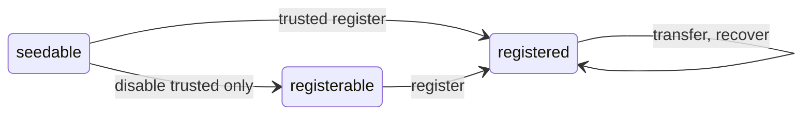
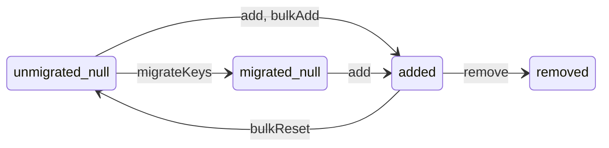

# Farcaster Contracts Documentation

## Table of Contents

1. [Id Registry](#1-id-registry)
2. [Storage Contract](#2-storage)
3. [Key Registry](#3-key-registry)
4. [Bundler Contract](#4-bundler)
5. [Fname Resolver](#5-fname-resolver)

## 1. Id Registry

The Id Registry contract lets users sign up and claim and identity on the Farcaster network. Users can call the contract to get identifier known as a Farcaster ID or `fid`. This is a unique integer which is mapped to the user's address known as the `custody address`. The Registry starts in the Seedable state where only a `trusted caller` can register new fids. This is used to migrate state safely if the contract ever needs to be redeployed.

A custody address can only own one fid at a time. Fids can be freely transferred between addresses as long as they do not violate this rule. The custody address can optionally nominate a `recovery address` that can authorized to move the fid at anytime. The custody address can change or remove the recovery address at any time.

### Administration

An `owner` address can change the contract state to Registrable, where anyone can register fids. This state change cannot be undone. The owner can also pause and unpause registrations though transfers and recoveries are not affected.

### State Machine

An fid can exist in three states:

- `seedable` - the fid has never been issued, and can be registered by the trusted caller
- `registerable` - the fid has never been issued, and can be registered by anyone
- `registered` - the fid has been issued to an address

The fid state transitions when users take specific actions:

- `register` - register a new fid from any address
- `trusted register` - register a new fid from the trusted caller
- `disable trusted only` - allow registration from any sender
- `transfer` - move an fid to a new custody address
- `recover` - recover (move) an fid to a new custody address

# 2. Storage

The Storage contract lets users with an fid rent storage space on Farcaster Hubs. Users must make a payment in Ethereum to the contract to acquire units of storage for one year. Acquiring storage emits an event which is read off-chian by the Farcaster Hubs, which allocate the appropriate space to the user. There is a maximum number of storage units available for rent defined as tunable parameter.

The contract is programmed to deprecate itself at a certain date, initialized to 1 year after the deployment. We expect to launch a new contract to handle rent every year with updated logic based on market conditions, though may extend the lifetime of the contract if necessary.

### Pricing

The rent price of a unit of storage is denominated in USD but must be paid in ETH. A chainlink price oracle is used to determine the exchange rate. Prices are updated periodically by calling the price feed, though guardrails are in place to ensure that prices are not updated if they are stale, out of bounds or if the sequencer was recently restarted.

Price changes occur when a transaction is made after the cache period has passed. The next payment of rent automatically invokes the price refresh. If the price is refreshed in a block, all transactions in that block are still allowed to pay the old price, and the refreshed price is only applied to future blocks, to make payments more predictable.

### Administration

An `operator` address can credit storage to fids without the payment of rent. This is used for the initial migration to assign storage to existing users, so that their messages aren't auto-expired from Hubs.

A `treasurer` address can move funds out of the contract to a pre-defined `vault` address, but cannot change this destination. Only the `admin` may change the address of the vault to a new destination.

An `admin` address can modify many parameters including the total supply of storage units, the price of rent, the duration for which exchange prices are valid and the deprecation timestamp.

# 3. Key Registry

The Key Registry contract lets users with an fid register a public key. Keys added onchain are tracked by Hubs can be use to sign Farcaster messages. An fid can remove a key from the registry but cannot add it back again. The same key can be added by different fids and can exist in different states.

Keys contain a scheme which indicates how they should be interpreted and used. During registration, metadata can also be emitted to provide additional context about the key.

### Administration

An `owner` address can perform bulk operations to add keys and undo the addition of keys to any fid. This is used to migrate state when the contract is launched. The owner can then call `migrateKeys()` which sets a migration timestamp. Hubs will watch for the `Migrated` event and then start listening

### State Machine

A key can exist in four states for each possible fid:

- `unmigrated_null` - the key has never been registered for the given fid and migration has not completed.
- `migrated_null` - the key has never been registered for the given fid and migration has completed.
- `added` - the key has been registered for a given fid.
- `removed` - the key has been registered and then removed for a given fid.

The key state transitions when fids take specific actions on keys they own:

- `add` - move a key from migrated_null to added for an fid.
- `remove` - move a key from added to removed for an fid.

The key state can also be transitioned by these owner actions that are only possible before the migration:

- `migrateKeys` - move all keys from unmigrated_null to migrated_null.
- `bulkAdd` - move keys from unmigrated_null to added for given fids.
- `bulkReset` - move keys from added to unmigrated_null for given fids.

# 4. Bundler

The Bundler contract helps save gas by claiming fid and storage units in a single transaction. It exposes methods that call the Registry and then the Storage contracts in sequence.

# 5. Fname Resolver

The Fname Resolver contract validates usernames issued under the \*.farcaster.xyz domain on-chain by implementing [ERC-3668](https://eips.ethereum.org/EIPS/eip-3668) and [ENSIP-10](https://docs.ens.domains/ens-improvement-proposals/ensip-10-wildcard-resolution). The resolver contains the url of the server which issues the usernames and proofs. It maintains a list of valid signers for the server and also validates proofs returned by the server.

### Administration

An `owner` can update the list of valid signers associated with the server.
