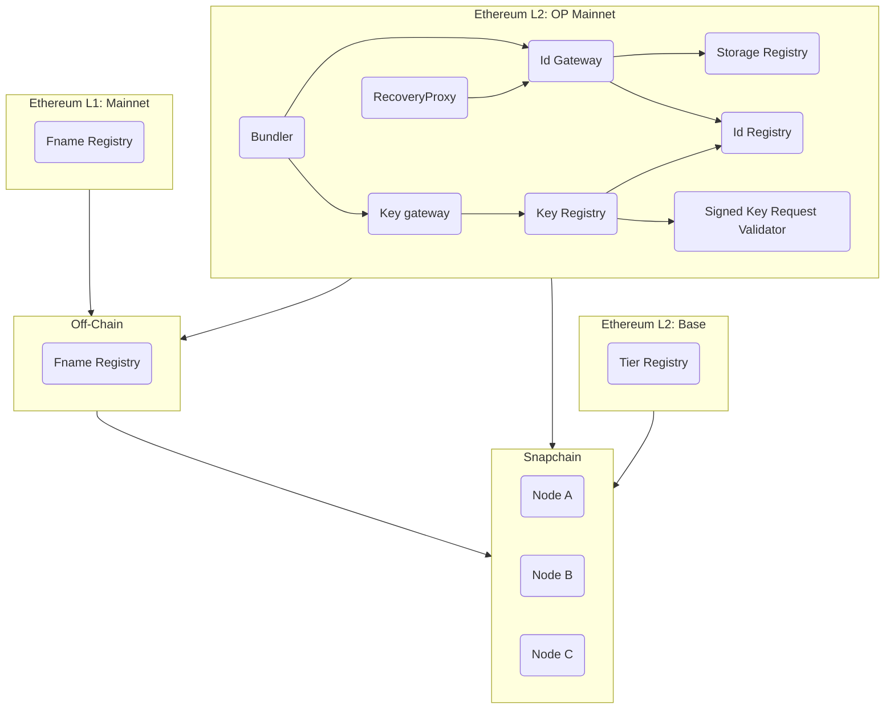
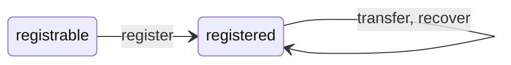
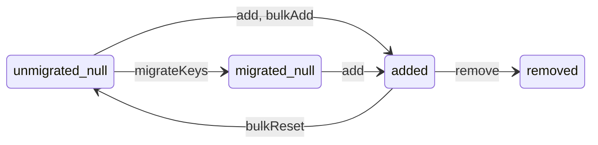

# Farcaster Contracts

Users create accounts by registering with onchain contracts. Farcaster contracts help set up identity key pairs, signing key pairs, usernames and with acquiring storage on offchain systems. Contracts are deployed across multiple chains and offchain services track the state of these contracts by watching for events.

This documentation is focused on the contracts but also clarifies assumptions made by offchain services. For a full overview of the Farcaster protocol, please [read the docs](https://docs.farcaster.xyz/) or watch the [overview videos](https://www.youtube.com/playlist?list=PL0eq1PLf6eUdm35v_840EGLXkVJDhxhcF).

## Table of Contents

1. [L2 Contracts](#1-l2-contracts)
   1. [Id Registry](#11-id-registry)
   2. [Id Gateway](#12-id-gateway)
   3. [Storage Registry](#13-storage-registry)
   4. [Key Registry](#14-key-registry)
   5. [Key Gateway](#15-key-gateway)
   6. [Validators](#16-validators)
   7. [Bundler](#17-bundler)
   8. [Recovery Proxy](#18-recovery-proxy)
   9. [Tier Registry](#19-tier-registry)
2. [L1 Contracts](#2-l1-contracts)
   1. [Fname Resolver](#21-fname-resolver)
3. [Offchain Systems](#3-off-chain-systems)
   1. [Fname Registry](#31-fname-registry)
   2. [Hubs](#32-hubs)

# 1. L2 Contracts

The Identity, Storage and Key Registry contracts are deployed on OP Mainnet. The Tier Registry contract is deployed on Base Mainnet.

## 1.1. Id Registry

IdRegistry lets any Ethereum address claim a unique Farcaster ID or `fid`. Fids are unique integers that map 1:1 to an Ethereum address known as the `custody address`. An address can own one fid at a time and transfer it to another address. The custody address may nominate a `recovery address` that can transfer the fid to a new custody address. The custody address can always change or remove the recovery address.

### Invariants

1. One fid per address: An address can only own one fid at a given time.
2. One address per fid: Multiple addresses cannot own the same fid at the same time.
3. Sequential IDs: If fid n was registered, then all fids from 1...n must also be registered.
4. One recovery address: An fid can have only one recovery address.

### Assumptions

1. owner is not malicious.

### Administration

The owner can pause and unpause the contract, which pauses registration, transfer, and recovery. The owner has one time use permissions to migrate data during the migration phase.

### Migration

The IdRegistry is deployed in a trusted state where keys may not be registered by anyone except the owner. The owner will populate the KeyRegistry with existing state by using bulk operations. Once complete, the owner will call `migrate()` to set a migration timestamp and emit an event. Hubs watch for the `Migrated` event and 24 hours after it is emitted, they cut over to this contract as the source of truth.

### Upgradeability

The IdRegistry contract may need to be upgraded in case a bug is discovered or the logic needs to be changed. In such cases:

1. A new IdRegistry contract is deployed.
2. The current IdRegistry contract is paused.
3. The new IdRegistry is seeded with all the registered fids in the old contract.
4. The KeyRegistry is updated to point to the new IdRegistry.
5. A new Bundler contract is deployed, pointing to the correct contracts.

## 1.2. Id Gateway

The IdManager is responsible for fid registration. While IdRegistry defines the rules of fid ownership, transfers, and
recovery, the manager is responsible for the actual registration logic. To prevent spamming fid registrations, the
IdManager requires callers to rent 1 [storage unit](#13-storage-registry) at fid registration time.

### Invariants

1. In untrusted mode, callers must rent 1 storage unit at fid registration time.
2. The contract can only transition to untrusted mode once, and never back to trusted mode.

### Assumptions

1. owner is not malicious.

### Administration

The owner can pause and unpause the contract, which pauses registration, transfer, and recovery.

### State Machine

An fid can exist in two states:

- `registrable` - the fid has never been issued and can be registered by anyone
- `registered` - the fid has been issued to an address

The fid state transitions when users take specific actions:

- `register` - register a new fid from any address
- `transfer` - move an fid to a new custody address
- `recover` - recover (move) an fid to a new custody address

### Upgradeability

The IdManager contract may need to be upgraded in case a bug is discovered or the logic needs to be changed. Since
the IdManager depends on storage, we expect to update this contract in the future if the storage system changes.

In such cases:

1. A new IdManager contract is deployed in the seedable state.
2. The IdRegistry is updated to point to the new IdManager.
3. The old IdManager is paused.
4. A new Bundler contract is deployed, pointing to the correct contracts.
5. The new IdManager is moved to the registrable state where anyone can register an fid.

## 1.3. Storage Registry

The StorageRegistry contract lets anyone rent units of storage space on Farcaster Hubs for a given fid. Payment must be made in Ethereum to acquire storage for a year. Acquiring storage emits an event that is read offchain by the Farcaster Hubs, which allocate space to the user. The contract will deprecate itself one year after deployment, and we expect to launch a new contract with updated logic. For more details, see [FIP-6](https://github.com/farcasterxyz/protocol/discussions/98).

### Pricing

The rental price of a storage unit is fixed in USD but must be paid in ETH. A Chainlink price oracle is used to determine the exchange rate. Prices are updated periodically, though checks are in place to revert if prices are stale, out of bounds, or if the sequencer was recently restarted.

A price refresh occurs when a transaction is made after the cache period has passed, which fetches the latest rate from the oracle. All transactions in that block can still pay the old price, and the refreshed price is applied to transactions in future blocks. A manual override is also present which can be used to fix the price and override the oracle.

### Invariants

1. Supply: rentedUnits never exceed maxUnits.
2. Pricing: Estimated price equals actual price within a block, i.e. `price(x) == _price(x)`.
3. Oracle override: price is calculated with fixedEthUsdPrice instead of ethUsdPrice if fixedEthUsdPrice > 0.
4. Caching: ethUsdPrice is updated from Chainlink no more often than priceFeedCacheDuration, if fixedEthUsdPrice is not set.
5. Deprecation: storage cannot be purchased after deprecationTimestamp.

### Assumptions

1. Rented units are never released since we expect to renew the contract after a year, and this avoids expensive calculations.
2. Chainlink oracle always returns a valid price for ETH-USD. (or it must be manually overridden).
3. Role admin, admin, treasurer and operator are not malicious

### Migration

The StorageRegistry contract does not contain any special states for migration. Once deployed, the operator can use the credit functions to award storage units to fids if necessary. We intend to use this function to credit existing users with storage.

### Administration

StorageRent defines multiple roles rather than a single owner address.

An `operator` role can credit storage to fids without the payment of rent. This is used for the initial migration to assign storage to existing users, so that their messages aren't auto-expired from Hubs.

A `treasurer` role can move funds from the contract to a pre-defined `vault` address, but cannot change this destination. Only the `owner` may change the vault address to a new destination. The `treasurer` may also refresh the oracle price.

An `owner` role can modify many parameters including the total supply of storage units, the price of rent, the duration for which exchange prices are valid and the deprecation timestamp. The owner may also pause and unpause the contract, disabling/enabling rentals and credits.

### Upgradeability

The StorageRegistry contract may need to be upgraded in case a bug is discovered or the logic needs to be changed. In such cases:

1. A new storage contract is deployed and is paused so that storage cannot be rented.
2. Hubs are upgraded so that they respect storage events from both contracts.
3. The older storage contract is deprecated, so that no storage can be rented.
4. A new Bundler contract is deployed, pointing to the correct contracts.
5. The new storage contract is unpaused.

## 1.4. Key Registry

The Key Registry contract lets addresses with an fid register or remove public keys. Keys added onchain are tracked by Hubs and can be used to sign Farcaster messages. The same key can be added by different fids and can exist in different states. Keys contain a key type that indicates how they should be interpreted and used. During registration, metadata can also be emitted to provide additional context about the key. Keys contain a metadata type indicating how this metadata should be validated and interpreted. The Key Registry validates metadata at registration time and rejects keys with invalid metadata.

### Key Types

The only key type today is TYPE_1 that indicates that a key is an EdDSA key and should be allowed to sign messages on behalf of this fid on Farcaster Hubs.

### Metadata Types

Key types may have multiple associated metadata types, indicating how their associated metadata should be validated and interpreted. The only metadata type today is key TYPE_1, metadata TYPE_1, for "signed key request" metadata. See section [1.4.1](#141-signed-key-request-validator) for more on signed key requests.

### Invariants

1. Addition: A key can only move to the added state if it was previously in the null state.
2. Valid metadata: A key can only move to the added state if its metadata passes validation.
3. Removal: A key can only move to the removed state if it was previously in the added state.
4. Reset: A key can only move to the null state if it was previously in the added state, the contract hasn't been migrated, and the action was performed by the owner.
5. Events: Event invariants are specified in comments above each event.
6. Limits: A new key may not be added if its addition would exceed the keys per fid limit.

### Assumptions

1. The IdRegistry contract is functional.
2. owner is not malicious.

### Migration

The KeyRegistry is deployed in the trusted state where keys may not be registered by anyone except the owner. The owner will populate the KeyRegistry with existing state by using bulk operations. Once complete, the owner will call `migrate()` to set a migration timestamp and emit an event. Hubs watch for the `Migrated` event and 24 hours after it is emitted, they cut over to this contract as the source of truth.

### State Machine

A key can exist in four states for each possible fid:

- `unmigrated_null` - the key has never been registered for the given fid and migration has not completed.
- `migrated_null` - the key has never been registered for the given fid and migration has completed.
- `added` - the key has been registered for a given fid.
- `removed` - the key has been registered and then removed for a given fid.

The key state transitions when fids take specific actions on keys they own:

- `add` - move a key from migrated_null to added for an fid.
- `remove` - move a key from added to removed for an fid.

The key state can also be transitioned by these owner actions that are only possible before the migration:

- `migrateKeys` - move all keys from unmigrated_null to migrated_null.
- `bulkAdd` - move keys from unmigrated_null to added for given fids.
- `bulkReset` - move keys from added to unmigrated_null for given fids.

### Upgradeability

The KeyRegistry contract may need to be upgraded in case a bug is discovered or the logic needs to be changed. In such cases:

1. A new KeyRegistry contract is deployed in a state where only an owner can update keys.
2. The old KeyRegistry contract has its IdRegistry address set to address(0), which prevents changes.
3. The state of all existing keys is copied from the old contract to the new one by an owner.
4. A new Bundler contract is deployed, pointing to the correct contracts.
5. The contract is set to untrusted state where anyone can register keys.

## 1.5. Key Gateway

The Key Gateway is the user-facing contract responsible for adding new keys to the Key Registry. While IdRegistry defines the rules of key addition and deletion, the Key Gateway is responsible for the actual addition logic.

### Invariants

1. Fee: A key may only be added

### Assumptions

1. The KeyRegistry contract is functional.
1. The StorageRegistry contract is functional.
1. owner is not malicious.

### Administration

The Key Gateway owner may pause and unpause the contract, disabling/enabling adding keys to the Key Registry.

### Upgradeability

The KeyManager contract may need to be upgraded in case a bug is discovered or the logic needs to be changed.

In such cases:

1. A new KeyManager contract is deployed.
2. The KeyRegistry is updated to point to the new KeyManager.
3. The old KeyManager is paused.
4. A new Bundler contract is deployed, pointing to the correct contracts.

## 1.6 Validators

Validators are single purpose contracts that implement a simple interface to validate key metadata. At registration time, the Key Registry looks up the associated validator by key type and metadata type, and calls it to validate the format of provided metadata. This makes the key registry extensible to future key types and metadata formats.

### 1.5.1 Signed Key Request Validator

The only validator today is the Signed Key Request Validator, which validates that EdDSA key metadata is a "signed key request." A signed key request represents a third party request to add a public key associated with an fid. Requesting parties must own an fid in order to identify their key requests, and sign a message over their fid and the public key in order to authenticate their request. This allows third party applications requesting signer keys to identify themselves to users, and users to validate the authenticity of signer requests before approving them onchain.

#### Administration

An `owner` can update the address of the Id Registry contract.

## 1.7. Bundler

The Bundler contract lets a caller register an fid, rent storage units and register a key in a single transaction to save gas. It is a simple wrapper around contract methods and contains little logic beyond tracking contract addresses, collecting parameters and invoking the appropriate functions.

## 1.8 Recovery Proxy

The Recovery Proxy is an immutable proxy contract that allows the recovery execution logic to change without changing the recovery address associated with an fid. A client or recovery service operator can deploy a recovery proxy and use it as the recovery address for fids. For example, the Warpcast client uses a recovery proxy owned by a 2/3 multisig as the default recovery address for new accounts.

#### Administration

A recovery proxy can change its `owner`, and may be owned by an EOA, multisig, or smart contract. The `owner` of the recovery proxy can change the configured `IdRegistry` address.

## 1.9 Tier Registry

The Tier Registry contract lets addresses purchase a subscription tier for an fid for a certain amount of time. Time purchased for each tier is additive. Each tier is also associated with some metadata including the token payment is accepted in and the price per day. Being a member of a tier will guarantee an fid a certain set of additional features on the Farcaster protocol until the time purchased expires.

### Tiers

The only tier today is the Pro tier (id 1) which guarantees users on the protocol long casts and 4 embeds.

### Invariants

1. Adding a tier: Tier ids are strictly incrementing. A new tier will have an id of 1 + the last added tier id.
2. Deactivating a tier: A tier can only be deactivated if it has been created and isn't already deactivated.
3. No balance: The contract never holds a payment token balance.
4. Events: Event invariants are specified in comments above each event.

### Assumptions

1. Owner is not malicious.
2. Payment tokens will not include [weird ERC20s](https://github.com/d-xo/weird-erc20).

### Migration

This is the first TierRegistry contract so no migration is required.

### Upgradeability

The TierRegistry contract may need to be upgraded in case a bug is discovered or the logic needs to be changed. In such cases:

1. A new TierRegistry contract should be deployed in a paused state
2. The tier metadata (payment token, price, min and max times per purchase) should be manually entered by the owner using `setTier`
3. The owner should resume the contract

# 2. L1 Contracts

The Fname Resolver contract is deployed on L1 Mainnet (chainid: 1).

# 2.1. Fname Resolver

The Fname Resolver contract validates usernames issued under the \*.fcast.id domain onchain by implementing [ERC-3668](https://eips.ethereum.org/EIPS/eip-3668) and [ENSIP-10](https://docs.ens.domains/ens-improvement-proposals/ensip-10-wildcard-resolution). The resolver contains the url of the server which issues the usernames and proofs. It maintains a list of valid signers for the server and also validates proofs returned by the server.

### Invariants

1. Authentication: resolving a name always reverts without a valid signature.

### Administration

An `owner` can update the list of valid signers associated with the server.

# 3. Offchain Systems

# 3.1. Fname Registry

The [Fname registry](https://github.com/farcasterxyz/fname-registry) is an offchain server that lets addresses with an fid acquire a unique username. Requests are authenticated by way of a signed message produced by the fid's custody address.

### Assumptions

- All event history from IdRegistry will be accessible via an OP Mainnet node.
- OP Mainnet will not re-org after 6 confirmations are received.

# 3.2. Hubs

[Hubs](https://docs.farcaster.xyz/learn/architecture/hubs) are offchain servers that store data on behalf of addresses that have registered an fid. They track the IdRegistry to know the addresses that have an fid, the StorageRegistry to find out how many messages they are allowed to store and the KeyRegistry to find out which key pairs can sign messages on behalf of the user.

### Assumptions

- All event history from IdRegistry, KeyRegistry and StorageRegistry will be accessible via an OP Mainnet node.
- OP Mainnet will not re-org after 6 confirmations are received.
