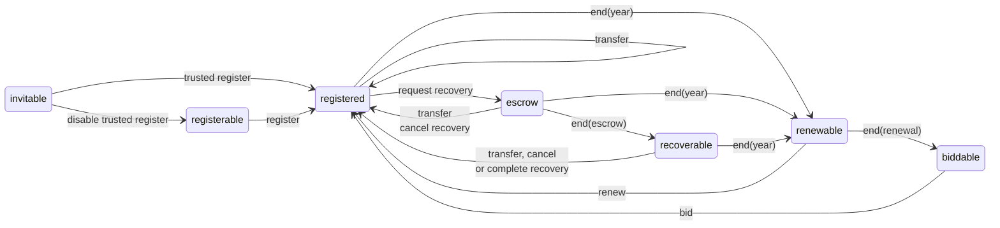

# Farcaster Contracts Documentation

Documentation that covers the high-level functionality of each contract in the system.

## Table of Contents

1. [ID Registry](#1-id-registry)
2. [Name Registry](#2-name-registry)
3. [Recovery System](#3-recovery-system)

## 1. ID Registry

The ID Registry contract issues Farcaster IDs (fids) for the Farcaster network.

An `fid` is a uint256 that represents a unique user of the network. Fids begin at 0 and increment by one for every new account. There is an infinite supply of fids since they can go as high as ~10^77. IDs begin in the invitable state, where they can only be registered by a pre-determined address. The owner can disable trusted registration which then allows anyone to register an fid.

Each address can only own a single fid at a time, but they can otherwise be freely transferred between addresses. The address that currently owns an fid is known as the `custody address`. The contract implements a [recovery system](#3-recovery-system) that protects users if they lose access to this address.

### State Machine

An fid can exist in these states:

- `invitable` - the fid has never been issued, and can be registered by the trusted sender
- `registerable` - the fid has never been issued, and can be registered by anyone
- `registered` - the fid has been issued to an address
- `escrow` - a recovery request has been submitted and is pending escrow
- `recoverable` - a recovery request has completed escrow and is pending completion.

The fid state transitions when users take specific actions:

- `register` - register a new fid from any address
- `trusted register` - register a new fid from the trusted sender
- `disable trusted register` - allow registration from any sender
- `transfer` - move an fid to a new custody address
- `request recovery` - request a recovery of the fid
- `cancel recovery` - cancel a recovery that is in progress
- `complete recovery` - complete a recovery that has passed the escrow period

The fid state can automatically transition when certain periods of time pass:

- `end(escrow)` - 3 days from the `request recovery` action

## 2. Name Registry

The Name Registry contract issues Farcaster names (fnames) for the Farcaster network.

An `fname` is an ERC-721 token that represents a unique name like @alice. An fname can have up to 16 characters that include lowercase letters, numbers or hyphens. It should that match the regular expression `^[a-zA-Z0-9-]{1,16}$`. The address that owns an fname is known as the `custody address`. The contract implements a [recovery system](#3-recovery-system) that protects users if they lose access to this address. Similar to IDs, Farcaster Names also begin in the invitable state, where they can only be registered by a pre-determined address. The owner can disable trusted registration which then allows anyone to register an fname.

Fnames can be registered for up to a year by paying the registration fee, similar to domain names. Unlike most ERC-721 tokens, minting the token does not imply permanent ownership. Registration uses a two-phase commit reveal system to prevent frontrunning.

1. When a new fname is registered, the user must pay the yearly fee, and the token enters the `registered` state and remains there until the end of the calendar year. The fee pair is pro-rated by the amount of time left until the year's end.

2. All fnames move from `registered` to `renewable` on Jan 1st 0:00:00 GMT every year. Owners have until Feb 1st 0:00:00 GMT to renew the fname by paying a full year's fee to the contract.

3. All fnames that have not been renewed become `biddable` on Feb 1st and move into a [dutch auction](https://en.wikipedia.org/wiki/Dutch_auction). The initial bid is set to a premium of 1,000 ETH plus the pro-rated fee for the remainder of the year. The premium is reduced by ~10% every hour until it reaches zero. An fname can remain indefinitely in this state until it is bid on and becomes `registered`.

4. If an fname is expired (`renewable` or `biddable`) the `ownerOf` function will return the zero address, while the `balanceOf` function will include expired names in its count.

### State Machine

An fname can exist in these states:

- `invitable` - the name has never been minted, and can only be minted by the trusted sender
- `registerable` - the name has never been minted and can be minted by anone
- `registered` - the name is registered to an address
- `renewable` - the name's registration has expired and it can only be renewed by the owner
- `biddable` - the name's registration has expired and it can be bid on by anyone
- `escrow` - a recovery request has been submitted and is pending escrow
- `recoverable` - a recovery request has completed escrow, but is pending completion.

Only the `registerable` and `biddable` states are terminal, all other states have a time-based action that will eventually transition them to another state. The `reclaim` action is excluded from the diagram for brevity, but conceptually it can move a name from any state to the `registered` state.

The fname state transitions when users take certain actions:

- `register` - mint a new fname from any sender
- `trusted register` - mint a new fname from the trusted sender
- `disable trusted register` - allow registrations from any sender
- `transfer` - move a fname to a new custody address
- `renew` - pay the renewal fee on a renewable fname
- `bid` - place a bid on a biddable fname
- `request recovery` - request a recovery of the fname
- `cancel recovery` - cancel a recovery that is in progress
- `complete recovery` - complete a recovery that has passed the escrow period

The fname state can automatically transition when certain periods of time pass:

- `end(year)` - the end of the calendar year in GMT
- `end(renewal)` - 31 days from the expiration at the year's end (Feb 1st)
- `end(escrow)` - 3 days from the `request recovery` action

### Permissions

The Name Registry, unlike the ID Registry, implements an Access Control system that defines roles which can be granted to different addresses. The system has two high permissioned roles which must be kept secure to perform infrequent, sensitive operations:

- **Default Admin** - Can grant and revoke all other roles, including Admin.
- **Admin** - Used to upgrade the contract, change the vault, change the trusted sender and disable trusted sending.

The system also has three lower permissioned roles that can be granted to people performing more frequent operations:

- **Operator** - Used by on-call teams to pause and resume the contract.
- **Moderator** - Used by moderators to reclaim names from users and change the location to which they are reclaimed.
- **Treasurer** - Used to withdraw funds to the vault and set the fee rate.

## 3. Recovery System

Both contracts implement a recovery system that protects the owner against the loss of the `custody address`.

1. The `custody address` can nominate a `recovery address` that is authorized to move a fname/fid on its behalf. This can be changed or removed at any time.

2. The `recovery address` can send a recovery request which moves the fname/fid into the `escrow` state. After the escrow period, the fname/fid becomes `recoverable`, and the `recovery address` can complete the transfer.

3. During `escrow`, the `custody address` can cancel the recovery, which protects against malicious recovery addresses.

4. The `recovery address` is removed, and any active requests are cancelled if the `custody address` changes due to a transfer or other action.
