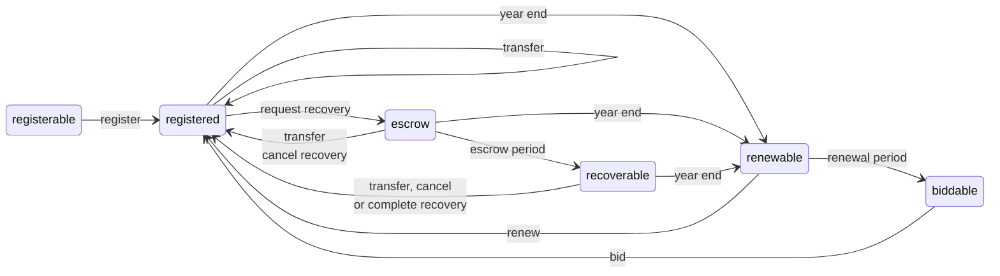

# Namespace Contract

The namespace contract issues usernames for the Farcaster network.

A username is an ERC-721 token that represents a unique name like @alice. A username can have upto 16 characters that include lowercase letters, numbers or hyphens. It should that match the regular expression `^[a-zA-Z0-9-]{1,16}$`. The address that currently owns a username is known as the `custody address`.

## Registration

Usernames can be registered for upto a year by paying the registration fee, similar to domain names. Unlike most ERC-721 tokens, minting the token does not imply permanent ownership.

1. When a new name is minted, the user must pay the yearly fee and the token enters the `registered` state and remains there until the end of the calendar year. The fee pair is pro-rated by the amount of time left until the year's end.

2. All usernames move from `registered` to `renewable` on Jan 1st 0:00:00 GMT every year. Owners have until Feb 1st 0:00:00 GMT to renew the username by paying a full year's fee to the contract.

3. All usernames that have not been renewed become `biddable` on Feb 1st and move into a [dutch auction](https://en.wikipedia.org/wiki/Dutch_auction). The initial bid is set to a premium of 1,000 ETH plus the pro-rated fee for the remainder of the year. The premium is reduced by ~10% every hour until it reaches zero. A username can remain indefinitely in this state until it is bid on and becomes `registered`.

4. If a username is expired (`renewable` or `biddable`) the `ownerOf` function will return the zero address, while the `balanceOf` function will include expired names in its count.

## Recovery

The recovery system allows the owner to protect themselves against loss of the `custody address`.

1. The `custody address` can nominate a `recovery address` which is authorized to move a username on its behalf. This can be changed or removed at any time.

2. The `recovery address` can send a recovery request which moves the username into the `escrow` state. After the escrow period has passed, the username becomes `recoverable` and the `recovery address` can complete the transfer.

3. During `escrow`, the `custody address` can cancel the recovery, which protects against malicious recovery addresses.

4. The `recovery address` is removed and any active requests are cancelled if the `custody address` changes due to a transfer or other action.

## State Diagram

A username can exist in these states:

- `registerable` - the name has never been minted and is available to mint
- `registered` - the name is currently registered to an address
- `renewable` - the name's registration has expired, but it can only be renewed by the owner
- `biddable` - the name's registration has expired, and it can be bid on by anyone
- `escrow` - a recovery request has been submitted, but is pending escrow
- `recoverable` - a recovery request has completed escrow, but is pending completion.

Only the `registerable` and `biddable` states are terminal, all other states have a time-based action that will eventually transition them to another state. The `reclaim` action is excluded from the diagram for brevity, but conceptually it can move a name from any state to the `registered` state.

The username state transitions when users take certain actions:

- `register` - "minting" a new username
- `transfer` - moving a username to a new custody address
- `renew` - paying the renewal fee on a renewable username
- `bid` - placing a bid on a biddable username
- `request recovery` - requesting a recovery of the username
- `cancel recovery` - cancelling a recovery that is in progress
- `complete recovery` - completing a recovery that has passed the escrow period

The username state can automatically transition when certain periods of time pass:

- `year end` - the end of the calendar year in GMT
- `renewal period` - 31 days from the expiration at the year's end (Feb 1st)
- `escrow period` - 3 days from the `request recovery` action
